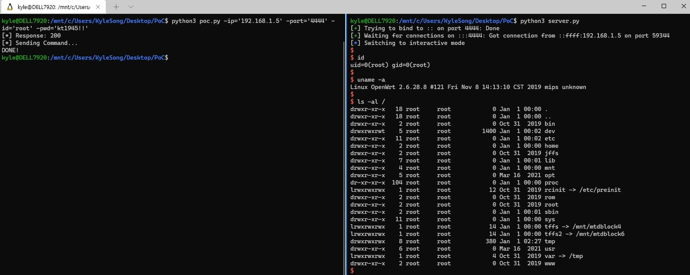

## CVE-2022-23333
### Command Injection Vulnerability (Remote Code Execution)
- **Product:** VoIP Gateway
- **Model:** ACOM508/ACOM516/ACOM532 (Ejoin Technology)
- **Affect Version:**  
  \- 508-609-900-241-100-020 or below  
  \- 532-609-915-041-100-020 or below
- **CVSS:** 8.8 High (CVSS:3.1/AV:N/AC:L/PR:L/UI:N/S:U/C:H/I:H/A:H)
- **Description**: Command injection vulnerability in Manual Ping (Web UI) allows a remote attacker to inject arbitrary code via the field. Attack command needs to be split as the device only takes 5 strings each time through the web.
- **PoC Result:**
